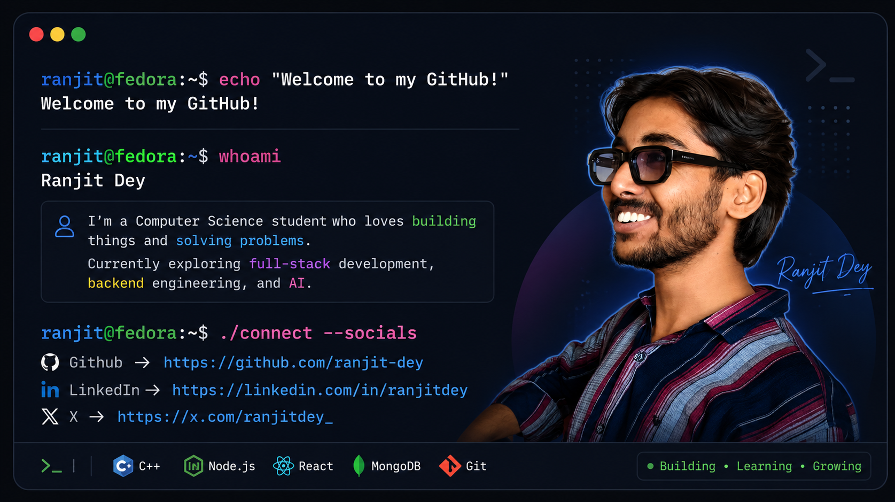
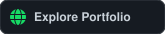
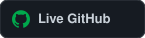
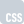

<table>
  <tbody>
    <tr>
      <td align="center" width="44" height="44"></td>
      <td align="center" width="44" height="44"></td>
      <td align="center" width="44" height="44"></td>
      <td align="center" width="44" height="44"></td>
      <td align="center" width="44" height="44"></td>
    </tr>
  </tbody>
</table>

##  whoami

Hi, I'm **Ranjit Dey**, a CS Guy who loves building things, solving problems, and learning new technologies.
Currently exploring full-stack development, backend engineering, and AI while turning ideas into real-world projects.

 &nbsp;&nbsp; 

---

##  Tech Stack & Tools

<table>
  <tbody>
    <tr>
      <td align="center" width="48" height="48"></td>
      <td align="center" width="48" height="48"></td>
      <td align="center" width="48" height="48"></td>
      <td align="center" width="48" height="48"></td>
      <td align="center" width="48" height="48"></td>
      <td align="center" width="48" height="48"></td>
    </tr>
    <tr>
      <td align="center" width="48" height="48"></td>
      <td align="center" width="48" height="48"></td>
      <td align="center" width="48" height="48"></td>
      <td align="center" width="48" height="48"></td>
      <td align="center" width="48" height="48"></td>
      <td align="center" width="48" height="48"></td>
    </tr>
    <tr>
      <td align="center" width="48" height="48"></td>
      <td align="center" width="48" height="48"></td>
      <td align="center" width="48" height="48"></td>
      <td align="center" width="48" height="48"></td>
      <td align="center" width="48" height="48"></td>
      <td align="center" width="48" height="48"></td>
    </tr>
  </tbody>
</table>

---

##  GitHub Stats & Activity

<table>
  <tbody>
    <tr>
      <td align="center"></td>
      <td align="center"></td>
    </tr>
  </tbody>
</table>

 

---

##  Public APIs for Developers

You can query real-time GitHub statistics and contribution calendars for **any GitHub account** using the open APIs deployed on my portfolio:

| Endpoint | Method | Description |
| :--- | :---: | :--- |
| [`/api/contributions?username={user}`](https://ranjitdey.in/api/contributions?username=ranjit-dey) | `GET` | Full day-by-day contribution counts, streaks & calendar |
| [`/api/stats?username={user}`](https://ranjitdey.in/api/stats?username=ranjit-dey) | `GET` | Stars, forks, repos, rank level (S+/A+/A), PRs & monthly trends |
| [`/api/svg/stats?username={user}`](https://ranjitdey.in/api/svg/stats?username=ranjit-dey) | `GET` | Dynamic real-time statistics SVG badge |
| [`/api/svg/streak?username={user}`](https://ranjitdey.in/api/svg/streak?username=ranjit-dey) | `GET` | Dynamic contribution streak SVG counter |
| [`/api/svg/activity?username={user}`](https://ranjitdey.in/api/svg/activity?username=ranjit-dey) | `GET` | Dynamic monthly activity graph SVG |

> **Base URL:** `https://ranjitdey.in` — free to use in your own profile README!

---

**Thanks for visiting!**

