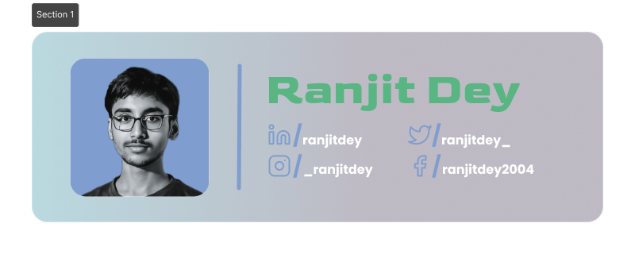

# Ranjit Dey

## whoami 👋

Hi, I'm **Ranjit**, a final-year Computer Science student with a passion for full stack web development and exploring new technologies. I enjoy working on personal projects, building responsive websites, and experimenting with UI/UX design. I am also focused on strengthening my skills in Data Structures and Algorithms using Java.

[Visit my portfolio](https://ranjitdey.vercel.app/)

### Github Stats 📊

|   |          |
| ------------------------------------------------------------------------------------------------------------------------------------------------------------------------------------------------------------------------------------------------------------------------------------------------------------------ | --------------------------------------------------------------------------------------------------------------------------------------------------------------------------------------------------------------------------------------------------------------------------------------------------------------------------- |
|  |  |

<!-- == Activity Graph == -->

<!-- Light Mode -->

**Thanks for visiting..**
